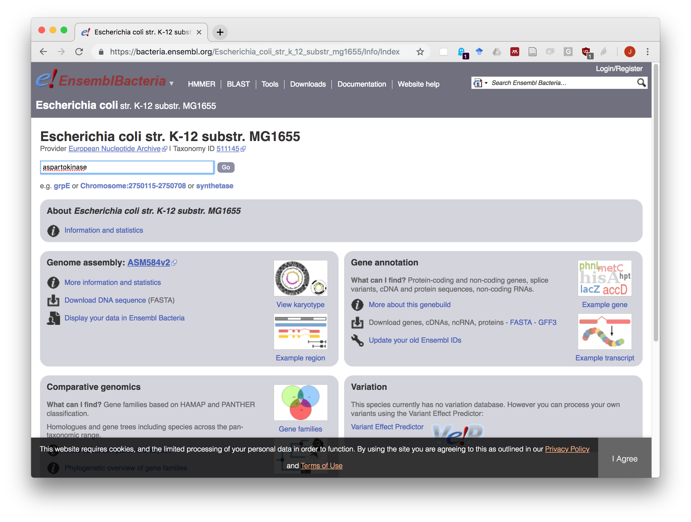
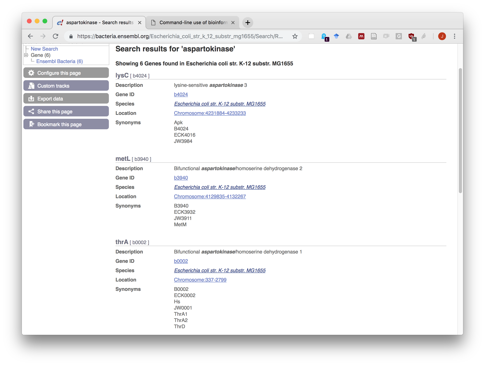
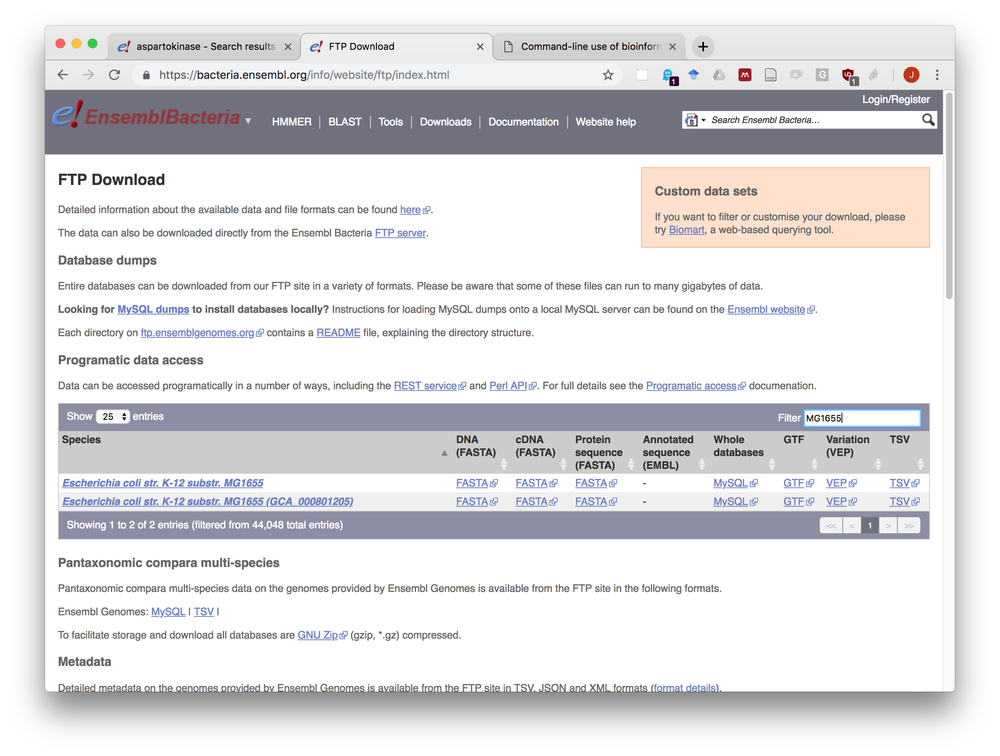

```{r setup, include=FALSE}
library(knitr, warn.conflicts = FALSE)
knitr::opts_chunk$set(
  echo = TRUE, 
  results = TRUE, 
  message = FALSE,
  fig.align = "center")

dir.main <- "~/IFB/NNCR/using_IFB_NNCR/"
dir.tp <- file.path(dir.main, "practicals", "")
setwd(dir.tp)

```

****************************************************************
# Prerequisite

This practical assumes that you are connected to a cluster of the IFB NNCR. This enables you to benefit from a software environment with pre-installed software tools for the different fields of bioinformatics.

To open a connection to the IFB NNCR, follow the totirla  [Tutorial](../NNCR-cluster_connection/NNCR-cluster_connection.html) | 


# Resources

| Resource | URL and description |
|-----------------------|--------------------------------------------|
| Ensembl Bacteria | https://bacteria.ensembl.org/index.html <br>Database and browser for bacterial and archaeal genomes maintained at the European Bioinformatics Institute (EBI) |
| GTF format | <https://genome.ucsc.edu/FAQ/FAQformat.html#format4> <br>Specification of the Gene Transfer Format (GTF) on the UCSC genome browser Web site | 
| Ensembl Bacteria Metadata | <ftp://ftp.ensemblgenomes.org/pub/release-41/bacteria/species_EnsemblBacteria.txt><br>table with information about each sequenced genome |
| Selected genomes | [MICROME genome table](data/microme_selected_organisms_cross_references.tsv)<br>A table containing 80 genomes of interest for the MICROME European network. | 

# Tutorial

## Browsing genomes with EnsemblGenomes

As reference genome, we will use the strain *K12 MG1655* of  *Escherichia coli*. 

1. In a web browser, open a connexion to Ensembl Bacteria (<https://bacteria.ensembl.org>).

2. In the  **Search for a genome** box, type *MG1655*. The interface will display a list of the genomes matching this string. Select the strain with taxonomic ID (TAXID) *511145*.

```{r out.width="60%", fig.cap="**EnsemblGenomes Bacteria organism choice**. ", echo=FALSE}

```
3. After having selected your bacteria of interest, type *aspartokinase* in the search box and start the search. 

```{r out.width="60%", fig.cap="**EnsemblGenomes gene search**. ", echo=FALSE}

```


4. Read the annotation of the three first matches. Note the names of the genes coding for these three enzymes. 

```{r out.width="60%", fig.cap="**EnsemblGenomes search result for *aspartokinase***. ", echo=FALSE}

```

## Downloading genomic features and protein sequences

We will use blast on the command line to search for homologs of *E.coli*  aspartokinases in other bacterial genomes.

Each student will chose a different bacteria to perform the search. 

## Downloading protein sequences and gene annotations from Ensembl genome

1. In a separate window, open a connection to [EnsemblGenomes Bacteria](https://bacteria.ensembl.org/) (<https://bacteria.ensembl.org/>).

2. Click on the **Downloads* link (you can also access it directly here: <https://bacteria.ensembl.org/info/website/ftp/>). 

3. In the **filter** box, type MG1655. This select the subset of genomes whose name contains this string. 

```{r out.width="60%", fig.cap="**EnsemblGenomes download filter**. ", echo=FALSE}

```

4. Click on the **FASTA** link in the column **Protein sequences**/ 


5. and select **Copy link address**. 

```{r out.width="200", fig.cap="**EnsemblGenomes** Link to download all protein sequences for a selected organism. ", echo=FALSE}

```

5. Come back to the Unix terminal of the IFB NNCR.

6. Create a directory for the current practical. 

```{bash eval=FALSE}
mkdir -p ~/bacteria_blast
cd ~/bacteria_blast
```


7. type `wget --no-clubber ` and paste the content of the clipboard. This should give the following command (note: at the tiem you run this tutorial, the release may be different, this one is from October 2018). 


```{bash eval=FALSE}
wget --no-clobber ftp://ftp.ensemblgenomes.org/pub/release-41/bacteria//fasta/bacteria_0_collection/escherichia_coli_str_k_12_substr_mg1655/pep/Escherichia_coli_str_k_12_substr_mg1655.ASM584v2.pep.all.fa.gz

```

If you want to know the meaning of the `--no-clobber` option you can checek `wget` manual with the command.

```{bash eval=FALSE}
man wget
```
We will now check if the file has been correctly downloaded, and uncompress it. 

```{bash eval=FALSE}

## Check that the file is there
ls -l

## Uncompress the file
gunzip Escherichia_coli_str_k_12_substr_mg1655.ASM584v2.pep.all.fa.gz

# Measure the size of the uncompressed file
du -k Escherichia_coli_str_k_12_substr_mg1655.ASM584v2.pep.all.fa

# Check the 20 fist lines of the file
head -n 20 Escherichia_coli_str_k_12_substr_mg1655.ASM584v2.pep.all.fa

# Check the 20 last lines of the file
tail -n 20 Escherichia_coli_str_k_12_substr_mg1655.ASM584v2.pep.all.fa
```


## Downloading genome annotations

After having downloaded the protein sequences, we will download gene annotations. In EnsemblGenomes, annotations are available in different formats, including GTF, a text file with columns separated by tabulations. 

1. We In the browser, come back to the EnsemblGenomes Bacteria Download site, select MG1655 and follow the same instructions as above to download and uncompress the GTF file. 

2. Uncompress the gzip archive. 

### Solution

```{bash eval=FALSE}
## Download genome annotation file (GTF format)
wget --no-clobber ftp://ftp.ensemblgenomes.org/pub/release-41/bacteria//gtf/bacteria_0_collection/escherichia_coli_str_k_12_substr_mg1655/Escherichia_coli_str_k_12_substr_mg1655.ASM584v2.41.gtf.gz

## Uncompress genome annotation file
gunzip Escherichia_coli_str_k_12_substr_mg1655.ASM584v2.41.gtf.gz

## Check that the uncompressed file is there
ls Escherichia_coli_str_k_12_substr_mg1655.ASM584v2.41.gtf

## Check the head of the annotaiton file
head -n 20 Escherichia_coli_str_k_12_substr_mg1655.ASM584v2.41.gtf

## Check the tail
tail -n 10 Escherichia_coli_str_k_12_substr_mg1655.ASM584v2.41.gtf

```


## Exercise: genome annotations

As an exercise, you will now elaborate  Unix commands to explore the content of E.coli genome annotations. 

For this, we recommmend to use and combine the following commands. In order to fine-tune the parameters, read their manual on the Unix terminal by typing `man [command_name]` (for example `man wc`).

| Command | Usage |
|---------|---------------------------------------------------------|
| wc | count lines, words and characters of a file |
| cut | cut specific columns of a text file |
| grep | select rows of a file that match a given query (string, regular expression) |
| awk | a powerful tool to work on text files, combining row filters, column selections, and many other features. |
| sort | sort the rows of a text file based on user-specified columns. The sorting can be done either alphabetically or numerically, in ascending or descending order |
| uniq | discard redundant lines from a text file. The option `-c` counts the number of occurrences of each line in a redundant file |

You can learn more Unix commands by typing "Linux cheat sheet" in any Web search engine. 


We ask you to write all the answers in a text file, with comments, in order to enable other people to reproduce all your commands. 

### Questions

1. How many rows contains the GTF file for E.coli K12 MG1655 ?
2. How many annotation rows are there in the GTF file (for this, you need to discard the comment rows starting with a `#` character) ?

3. How many of these rows correspond to genes ? 

4. Count the number of instnces of each feature type in the GTF file. 

5. Select all the rows of the GTF file corresponding to a gene, and store them in a separate file named `genes_Escherichia_coli_str_k_12_substr_mg1655.ASM584v2.41.gtf`. 

### Solution

```{bash eval=FALSE, echo=FALSE}

## How many rows contains the GTF file for E.coli K12 MG1655 ?
wc -l Escherichia_coli_str_k_12_substr_mg1655.ASM584v2.41.gtf

## How many of these rows correspond to genes ? 
## How many annotation rows contains the GTF file 
grep -v '^#' Escherichia_coli_str_k_12_substr_mg1655.ASM584v2.41.gtf | wc -l

## How many of these rows correspond to genes ? 
grep -v '^#' Escherichia_coli_str_k_12_substr_mg1655.ASM584v2.41.gtf \
  | cut -f 3 | grep '^gene$' | wc -l

## Count the number of instnces of each feature type in the GTF file. 
grep -v '^#' Escherichia_coli_str_k_12_substr_mg1655.ASM584v2.41.gtf \
  | cut -f 3 \
  | sort \
  | uniq -c \
  | sort -n -r -k 1

## Select all the rows of the GTF file corresponding to a gene, and store them in a separate file named
grep -v '^#' Escherichia_coli_str_k_12_substr_mg1655.ASM584v2.41.gtf \
  | awk -F '\t' '$3 == "gene"' \
  > genes_Escherichia_coli_str_k_12_substr_mg1655.ASM584v2.41.gtf

## Check the number of rows selected by awk
wc -l genes_Escherichia_coli_str_k_12_substr_mg1655.ASM584v2.41.gtf

```

****************************************************************

# Searching sequence similarities with BLAST

## Activating the conda environment for blast on the NNCR cluster

In addition to facilitating the installation of software tools on different operating system, conda also permits to create modules that regroup a set of tools usually used together (for example NGS analysis, protein structure, proteomics, ...). 

The IFB NNCR cluster is already equipped with a series of conda environments with the classical bioinformatics tools.  Before being able to use a tool, you must activate the corresponding environment. 

```{bash eval=FALSE}
## List the conda environments available on the system
$CONDA_HOME/bin/conda env list

## FInd the blast environment
$CONDA_HOME/bin/conda env list | grep -i blast

## Activate the blast environment. 
source $CONDA_HOME/bin/activate blast-2.7.1

## Check the location of the blastp command
which blastp

## Deactivate the current environment. 
source $CONDA_HOME/bin/deactivate
## Note the change in the shell prompt

## Re-activate the blast environment
source $CONDA_HOME/bin/activate blast-2.7.1
## Note the change in the shell prompt

```

Note: if you are working on a machine that does not belong to the federation of NNCR clusters, you can create the blast environment in your own conda folder with the following command (assuming that the conda package has been installed and that its executable files are in your path). 


```{bash eval=FALSE}
## ATTENTION: DO NOT RUN THIS COMMAND IF YOU ARE ON THE NNCR CLUSTER,
## because this would occupy a big space to reinstall BLAST in your 
## own account, although it is already available for all users. 

## Install blast
conda create -n blast-2.7.1 blast==2.7.1

## Install emboss
conda create -n emboss-6.6.0 emboss==6.6.0
```


## Formatting the blast database for the reference genome

```{bash eval=FALSE}
## Check the path of the program makeblastdb (it should be in your conda folder)
which makeblastdb

## Get the usage of makeblastdb (formal specification of the command syntax)
makeblastdb -h

## Get the help for makeblastdb (explanation of the options)
makeblastdb -help

## Build a BLAST database with all the protein sequences of E.coli
makeblastdb -in Escherichia_coli_str_k_12_substr_mg1655.ASM584v2.pep.all.fa  -dbtype prot

## Check the new files that were created with this commands. 
## For this we list the files in reverse (-r) temporal (-t) order. 
ls -1tr

```


The program `makeblastdb` created three files besides the input fasta file. 

```
Escherichia_coli_str_k_12_substr_mg1655.ASM584v2.pep.all.fa.pin
Escherichia_coli_str_k_12_substr_mg1655.ASM584v2.pep.all.fa.phr
Escherichia_coli_str_k_12_substr_mg1655.ASM584v2.pep.all.fa.psq
```

These files contain an index of all the oligopeptites found in all the  sequences of the fasta file. This "k-mer" index will be used by BLAST to rapidly find all the sequences in the database that match a query sequence, and use these short correspondences to start an alignment. 


## Read *blastp* manual

Since we want to search a protein database with protein query sequences, we will use the `blastp` command. 

```{bash eval=FALSE}
## Command  syntax
blastp -h

## Help
blastp -help

```

OK, the first contact is a bit frightening, because blastp has many options. This is because this program allows you to run queries in different modes, with different parameters, and to export the results in different formats. 

In this tutorial we will show you the most usual ways to use the tool, and you will then be able to refine your search by combing back to the manual and understanding the use of  additional options. 

## Downloading a query protein

We will first search similarities from a given protein of interest. 
We will start from the "askartokinase 3" protein from *Escherichia coli*, which is the product of the gene lysC. 

Before starting the analysis, read the Uniprot record (<https://www.uniprot.org/uniprot/P08660>) in order to know the function and regulation of this protein.

We will use BLAST to identify all the proteins of *Escherichia coli* that have significant similarities with the aspartokinase 3. 

For this we first need to download the sequence of this protein on our computer. The sequence can be downloaded directly from Uniprot.

```{blast eval=FALSE}
wget --no-clobber https://www.uniprot.org/uniprot/P08660.fasta
```

## Similiraty search for one sequence against a database

The following command search similarities for one or several query sequences provided in a fasta file (`P08660.fasta`) in a protein sequence database (`Escherichia_coli_str_k_12_substr_mg1655.ASM584v2.pep.all.fa`). By default, blastp prints the result on the screen, but we prefer to redirect it to a file in order to keep a trace of the result and inspect it later.

```{bash eval=FALSE}
## Search similarities for aspartokinase 3 in E.coli proteome
blastp \
  -db Escherichia_coli_str_k_12_substr_mg1655.ASM584v2.pep.all.fa  \
  -query P08660.fasta \
  > lysC_vs_Ecoli.txt
  
## Check the result
less lysC_vs_Ecoli.txt
```

### Question set 1

<font color="#004488">
1. How many hits were found in total?
2. How many of these have an E-value higher than 1?
3. What was the threshold on the E-value for this blastp search?
4. With this threshold, how many hits would we expeect if we use a random sequence as query?
5. How many alignments would you consider significant in this result?
6. How many of these would you qualify of homologs?
7. For each of these putative homologs, is it a paralog, ortholog or "other log"?
8. Do you see a relationship between the E-value and some properties of the alignments?
</font>

## Getting a tabular synthesis of blast results

By default, BLAST displays the detailed results of a similaty search, starting with a summary of the matches, followed by all the alignemnts. It can be convenient to generate a synthetic result indicating only the relevant statistics for each alignment. This can be done by tuning  BLAST options. 

Read blastp manual and find a way to tune the formatting options in order to get a tabular output with comments. 

### Solution

```{bash eval=FALSE}
blastp -outfmt 7 \
  -db Escherichia_coli_str_k_12_substr_mg1655.ASM584v2.pep.all.fa  \
  -query P08660.fasta \
  > lysC_vs_Ecoli_synthesis.tsv

```


# Negative control: blast against a shuffled sequence

In this section, we will perform a quick empirical test, by submitting a random sequence to blastp. For this, we will shuffle the aminoacids of the original query sequence. 

## Shuffling sequences with a Web tool

One way to shuffle sequences is to use a convenient Web tool at <http://www.bioinformatics.org/sms2/shuffle_protein.html>


Here is an example of result (I just simplified the header of the shuffle output fasta sequence for the sake of readability). 

Of course, your result should differ since each shuffling produces a randomized sequence. 

```
>shuffled_lysC
VEAINNAVKRELSALGDVADLFVLEFDNDRLGWADAIIRVLLNTEMNGELKPAEVASAIV
GLIDEPELDTLVYSPLAGIFFLMCLIDFRGLGRREPTVPHSIMAGSGNALCRYFVTGLLL
LDTNAFAIRETKNLEAFVAEFQAADNFAQARNPANLPKLILCLSVNGVLQASPFFNLNEG
ADVVSESSAASLKADEDQSVITLEEDIVVTEGASSFDLALGLLMHLNVDRKVGAEWLEDE
VSPVMVEVLTLVLTQEALTVTSIALLRGDTRKRVGLVLNSFTSHDLIAPSLILIGTSLVT
RHFLVGAKVRIQERKASTSFRRLLAGRTETYRGLEIYAPCISMTTAVRRMQAGGIAHREI
QETIACRKSTELLSTIASPHAEVGFEAANGTLLGVLTADHVSMALQAVNGGESLPDEHRR
TVGDILTERVARLLLPFKEGPARTSSTLA
```

## Shuffling sequences with EMBOSS shuffleseq

```{bash eval=FALSE}
## Activate the conda environment with the emboss software suite
source  $CONDA_HOME/bin/activate emboss-6.6.0

## Check that shuffleseq is available
which shuffleseq

## Get the suffle manual 
shuffleseq -h

## Shuffle the apartokinase 3 sequence
shuffleseq -sequence P08660.fasta -outseq shuffled_lysC.fa

## Check the result
cat shuffled_lysC.fa

## Compare the shuffled seq with the original one
cat P08660.fasta
```


## Exercise

1. Shuffle the aspartokinase 3 sequence with the tool `shuffleseq` (found in the conda environment `emboss`). 

2. Run a `blastp` search with this shuffled sequence against all proteins of *Escherichia coli*. 

### Solution

```{bash eval=FALSE}
## Run blast with the shuffled lysC sequence against all E.coli proteins
blastp \
  -db Escherichia_coli_str_k_12_substr_mg1655.ASM584v2.pep.all.fa  \
  -query shuffled_lysC.fa \
  > shuffled_lysC_vs_Ecoli.txt
## Check the result
less shuffled_lysC_vs_Ecoli.txt

## Run the same query with a tabular output
blastp -outfmt 7 \
  -db Escherichia_coli_str_k_12_substr_mg1655.ASM584v2.pep.all.fa  \
  -query shuffled_lysC.fa \
  > shuffled_lysC_vs_Ecoli_synthesis.tsv

## Check the result
less shuffled_lysC_vs_Ecoli_synthesis.tsv
```


### Questions

1. How many alignments would you expect by chance with the default blastp parameters?
2. How many alignemnts did you get with the shuffled sequence?
3. How many of these had an E-value smaller than 1?
4. How many of these had an E-value smaller than 0.01?
5. How many of these would you qualify of homologs?


# Comparing all the proteins of a genome against another genome

## Downloading a query genome

1. In EnsemblGenomes Download page, find the genome of *Bacillus subtilis subsp. subtilis str. 168*. 

2. Download the genome annotation (GTF file) and protein sequences (fasta file). 


### Solution

```{bash eval=FALSE}
## Download genome annotations for query organism
wget --no-clobber ftp://ftp.ensemblgenomes.org/pub/release-41/bacteria//gtf/bacteria_0_collection/bacillus_subtilis_subsp_subtilis_str_168/Bacillus_subtilis_subsp_subtilis_str_168.ASM904v1.41.gtf.gz

## Download protein sequeces for query organism
wget --no-clobber ftp://ftp.ensemblgenomes.org/pub/release-41/bacteria//fasta/bacteria_0_collection/bacillus_subtilis_subsp_subtilis_str_168/pep/Bacillus_subtilis_subsp_subtilis_str_168.ASM904v1.pep.all.fa.gz
```


## All proteins from E. coli versus E. coli

**Exercise: ** build a command that compares the sequences of all the E.coli proteins against each other, and store the results in a tab-delimited file with a single line per hit (we do not need the alignments).   


****************************************************************
# References


