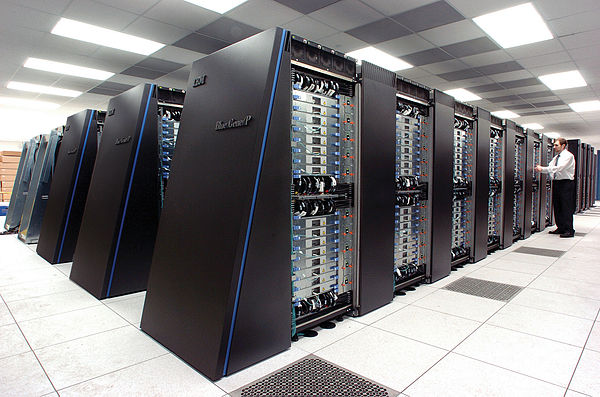

```{r include=FALSE, echo=FALSE, eval=TRUE}
library(knitr)

options(width = 300)
knitr::opts_chunk$set(
  fig.width = 7, fig.height = 5, 
  fig.align = "center", 
  fig.path = "figures/sampling-estimation_",
  size = "tiny", 
  echo = FALSE, eval = TRUE, 
  warning = FALSE, message = FALSE, 
  results = TRUE, comment = "")
# knitr::asis_output("\\footnotesize")

# dir.slides <- "~/IFB/NNCR/using_IFB_NNCR/slides/"
# setwd(dir.slides)

```

## Outils en ligne de commandes : pourquoi ?

- Un grand nombre d'outils bioinformatiques ne sont pas munis d'interfaces interactives

- Automatisation des tâches

    - Gestion de processus complexes avec de nombreuses tâches
    - Gestion de processus répétitifs: même tâche appliquée à de nombreux fichiers de données

- High performance computing (HPC)

    - utilisation de très grosses ressources de calcul et stockage

- Traçabilité et reproducibilité des analyses

    - scripts
    - workflows

## Environnements de travail 

La plupart des outils bioinformatiques peuvent être compilés pour les systèmes opérateurs de type Unix (Linux, Mac OS X), et ne tournent pas sous Windows. 

Différents environnements de travail peuvent être utilisés pour utiliser ces outils. 

- Terminal de votre propre ordinateur (Linux, Mac OS X)
- Machine Virtuelle ([VirtualBox](https://www.virtualbox.org/), [VWMare](https://www.vmware.com/))
- Conteneurs logiciels ([Docker](https://www.docker.com/), [singularity](https://www.sylabs.io/singularity/))
- Terminal d'une machine distante (par connexion ssh)
- Bureau Virtuel

## Machine virtuelle

- Composantes

    - machine hôte: votre PC
    - système opérateur de l'hôte (Linux, Mac, Windows)
    - hyperviseur: logiciel qui permet de créer et faire tourner les machines virtuelles sur l'hôte
    - machine virtuelle: émulation d'un autre ordinateur, qui tourne sur la machine hôte
    - système opérateur de la machine virtuelle: Linux, Windows, ...

- Applications typiques

    - faire tourner un système Linux sur un PC Windows ou Mac
    - tester un logiciel sous différents systèmes opérateurs
    - isoler un service du système hôte (sécurité, segmentation des ressources)

- Exemples de superviseurs

    - VirtualBox (<https://www.virtualbox.org/>)
    - VWMare (<https://www.vmware.com/>)


## Virtualisation basée sur des conteneurs

- Exécution d'applications sur un système opérateur partagé sans recours à une machine virtuelle

- Intérêt

    - combinaison d'applications et de librairies "à la carte"
    - usage plus restreint des ressources de la machine hôte

- Logiciels de gestion de conteneurs

    - Docker (<https://www.docker.com/>)
    - singularity (<https://www.sylabs.io/singularity/>)


## Machines virtuelles versus containers


```{r out.width="90%", fig.cap="**Comparaison de solutions de virtualisation.** Droite: machine virtuelle; centre: container Docker; droite: container Singularity . Source: Greg Kurtzer keynote at HPC Advisory Council 2017 @ Stanford"}
include_graphics("images/vm_vs_container.png")
```


## Installation d'applications dans le système opérateur local

- Avantages

    - Disponibilité des applications
    - Efficacité de l'exécution directe

- Désavantages

    - Dépendances (librairies système, librairies de langage, autres applications)
    - Incompatibilités entre dépendances de différentes applications
    - Certains logiciels et librairies requièrent une intervention de l'administrateur système
    - Diversité des [gestionnaires de paquets](https://fr.wikipedia.org/wiki/Gestionnaire_de_paquets) ([package managers](https://en.wikipedia.org/wiki/Package_manager)) selon les systèmes opérateurs (apt-get, yum, ports, brew, ...).
    - Certaines applications et librairies ne sont disponibles que pour certains gestionnaires de paquets

## Conda

- Doc : <https://conda.io/docs/>

- Avantages

    - Un gestionnaire de paquets multi-plateforme
    - Toutes les installations se font au niveau de l'utilisateur
    - Nombre croissant de logiciels et librairies  portés sous conda
    - Effort maintenu par une large communauté d'informaticiens
    - Gestion extrêmement précise des dépendances (version pour chaque élément)
    - Désinstallation aisée des logiciels qui ne sont plus nécessaires
    - L'essayer c'est l'adopter !

- Désavantages

    - Si  chaque utilisateur installe chaque outil et ses dépendances dans son propre compte, redondance et utilisation inutile d'espace disque

## Grappe de serveurs (computer cluster)

Une grappe de calcul est un ensemble d'ordinateurs (appelés ***noeuds**) qui peuvent être utilisés ensemble pour paralléliser des tâches. 

```{r out.width="60%", fig.cap="**Grappe de serveurs.** En avant-plan: *Homo sapiens* tentant d'établir une interaction physique avec les machines.  Source: <https://en.wikipedia.org/wiki/Parallel_computing>"}

```


## Parallélisation des tâches

La parallélisation des tâches (parallel computing) consiste à lancer simultanément uen série de processus informatiques sur un système informatique.

Les tâches peuvent être distribuées  sur plusieurs processeurs (**Computer Processing Unit**, **CPU**) d'un même ordinateur et/ou sur plusieurs ordinateurs (grappes de serveurs). 

La distribution des tâches sur les processeurs et ordinateurs repose sur un logiciel appelé **gestionnaire de tâches** (**job scheduler**). Les utilisateurs soumettent les tâches (sous forme de commandes de terminal) au gestionnaire, qui pilote leur exécution sur les différents processeurs et/ou noeuds d'une grappe. 


